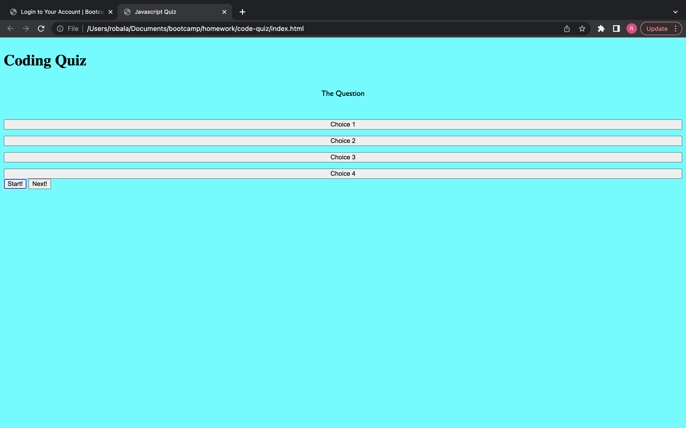

# Code-quiz

## Description

This project is a quiz created using HTML, CSS, and JavaScript. There is a timer element that counts down and there are three multiple choice questions.

## Usage

This application can either be launched through the github pages link, or by cloning the repository and opening the index.html file in the browser.

## Screenshot

## Link

[Link to Github pages](https://robala98.github.io/code-quiz/)

